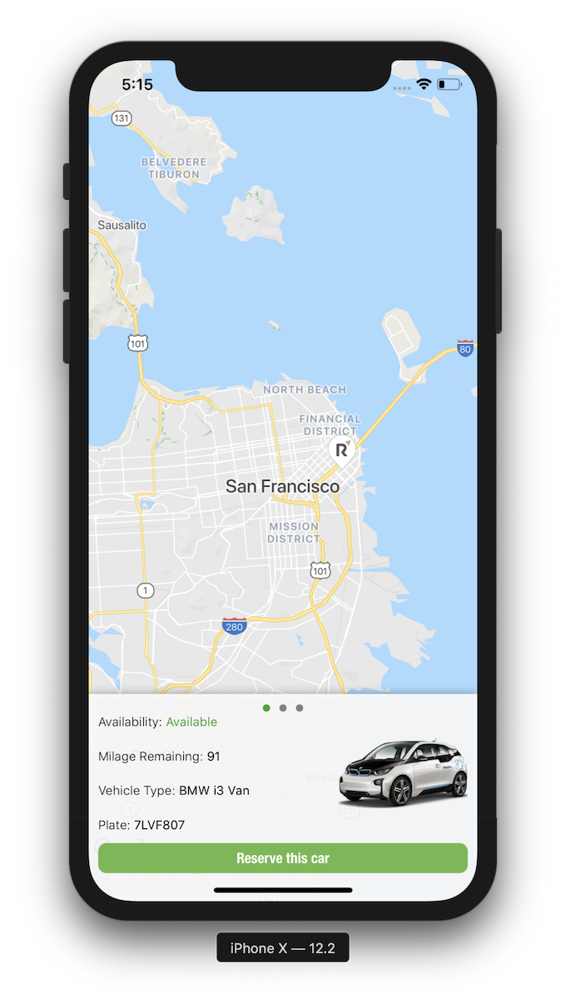

# Ridecell

### Functionalities

[x] Displays the annotated vehicles on Google Map
[x] map opens to San Francisco on launched
[x] Selected annotation show the car's information
[x] Scroll view at the bottom to choose vehicles and update to its location on the map

### Technologies used:
* [Google Maps SDK](https://developers.google.com/maps/documentation/ios-sdk/intro)
* Apple built in libraries
    * UIKit

### Testing
1. Clone this repository `git clone https://github.com/MhndMousa/Ridecell`
2. Navigate to the directory
3. Open the file with the extension of `Ridecell.xcworkspace`
    * To avoid any errors, make sure you change provision profile license to your license and change the Bundle identifier name to your own identifier

4. RUN
